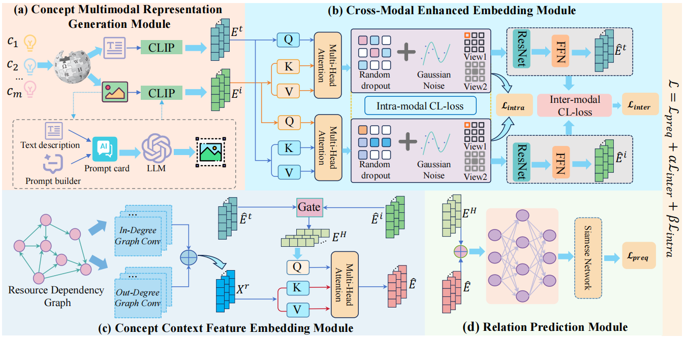

#  MMCPL: Multimodal Embedding Enhancement for Concept Prerequisite Learning

In this paper, we proposed MMCPL, a multimodal embedding enhancement method, to address the limitations of unimodal text modeling for Concept Prerequisite Learning. Our  approach integrated textual and image modalities of concepts. Specifically, by leveraging a cross-modal attention mechanism and a dual-branch contrastive learning strategy,  the method facilitated deep inter-modal interaction. This design effectively mitigated background noise in images and enhanced the discriminative power of concept representations. 

## 🛠 Installation

Ensure you have Python 3.7+ and the required dependencies installed. 

Make sure you have the following Python packages installed:

- torch==2.5.1+cu118
- torch-geometric==2.7.0
- scikit-learn==1.6.1
- pandas==2.2.3
- numpy==2.0.1
- scipy==1.15.3

#

